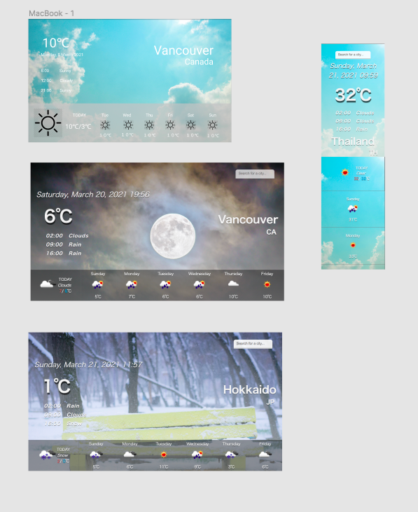

# About
## Weather App

This is a weather app which is for portfolio and not for release or monetize.

# Why I created this App
I created this app to practice using fetch API.
It is the first time to get json data from API and also creating an application for me.

I also tried to make beautiful layout even for mobile friendly. You can enjoy this app both web browsers and mobile devices.

# UI Design

I created UI design with [figma](https://www.figma.com/design/).
I arranged UI design during developing so first image is a little bit different from others. There are two types of background, daytime and nighttime. Also it will be changed depend on the local weather.

# Languages
- HTML / CSS
- Javascript
- jQuery

Since I practice to use Javascript, this is the main language I use.

# Upcoming Features
- Predictive search function
- Add weekly max/min temperatures
- Add humidity
- Add feels like temperature

# References
[Open Weather API](https://openweathermap.org/)